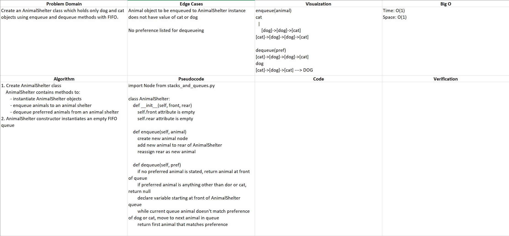

# README

## Queue with Stacks

### Author: Alex Angelico

### Problem Domain

Create an AnimalShelter class which holds only dog and cat objects using enqueue and dequeue methods with FIFO.

### Inputs and Expected Outputs

Input | Expected Output
----- | ---------------
enqueue(animal) [cat]->[dog]->[dog], cat | [cat]->[dog]->[dog]->[cat]
dequeue(pref) [cat]->[dog]->[dog]->[cat], dog | dog, [cat]->[dog]->[cat]

### Big O

Time: O(1)  
Space: O(1)

### Whiteboard

### Change Log

0.1: Started building AnimalShelter class - 13 Jan 2021
