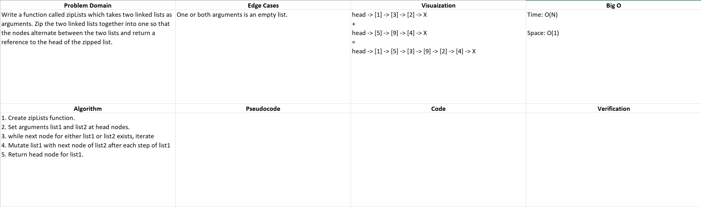

# README

## Zip Two Linked Lists

### Author: Alex Angelico

### Problem Domain

Write a function called zipLists which takes two linked lists as arguments. Zip the two linked lists together into one so that the nodes alternate between the two lists and return a reference to the head of the zipped list.

### Inputs and Expected Outputs

Input | Expected Output
----- | ---------------
head -> [1] -> [3] -> [2] -> X, head -> [5] -> [9] -> [4] -> X | head -> [1] -> [5] -> [3] -> [9] -> [2] -> [4] -> X

### Big O

Time: O(N)  
Space: O(1)

### Whiteboard

### Change Log

0.3: Started basic loop functionality - 04 Jan 2021
