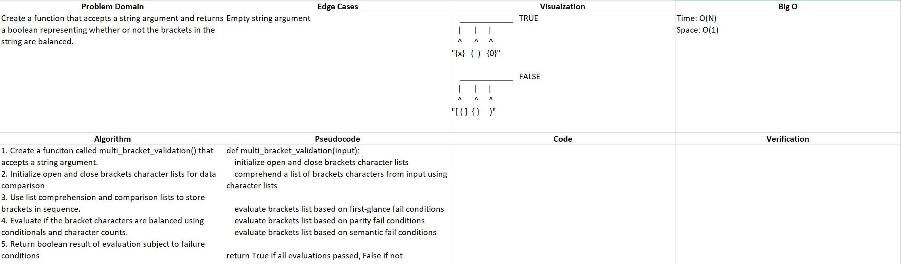

# README

## Multi-bracket Validation

### Author: Alex Angelico

### Problem Domain

Create a function that accepts a string argument and returns a boolean representing whether or not the brackets in the string are balanced.

### Inputs and Expected Outputs

Input | Expected Output
----- | ---------------
{} | TRUE
{}(){} | TRUE
()[[Extra Characters]] | TRUE
(){}[[]] | TRUE
{}{Code}[Fellows](()) | TRUE
[({}] | FALSE
(]( | FALSE
{(}) | FALSE

### Big O

Time: O(N)  
Space: O(1)

### Whiteboard

### Change Log

0.8: *Function design complete* - 21 Jan 2021
0.05: *Created readme and whiteboard* - 18 Jan 2021
