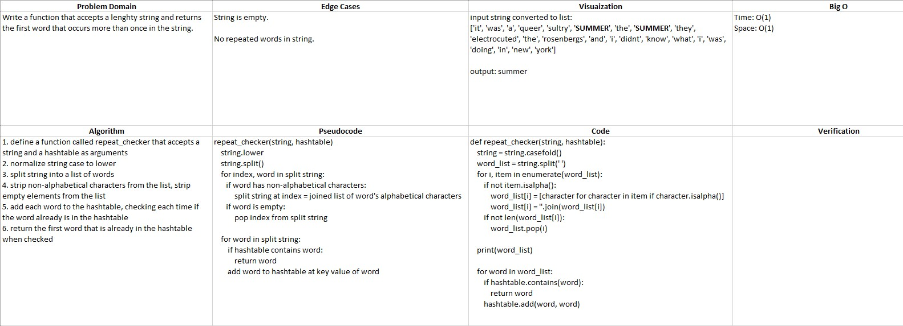

# README

## Repeated Word Checker

### Author: Alex Angelico

### Problem Domain

Write a function that accepts a lenghty string and returns the first word that occurs more than once in the string.

### Inputs and Expected Outputs

Input | Expected Output
----- | ---------------
[long string] | 'first repeated word'

### Big O

Time: O(1)  
Space: O(1)

### Whiteboard

### Change Log

1.0: *Challenge complete.* - 15 Mar 2021
