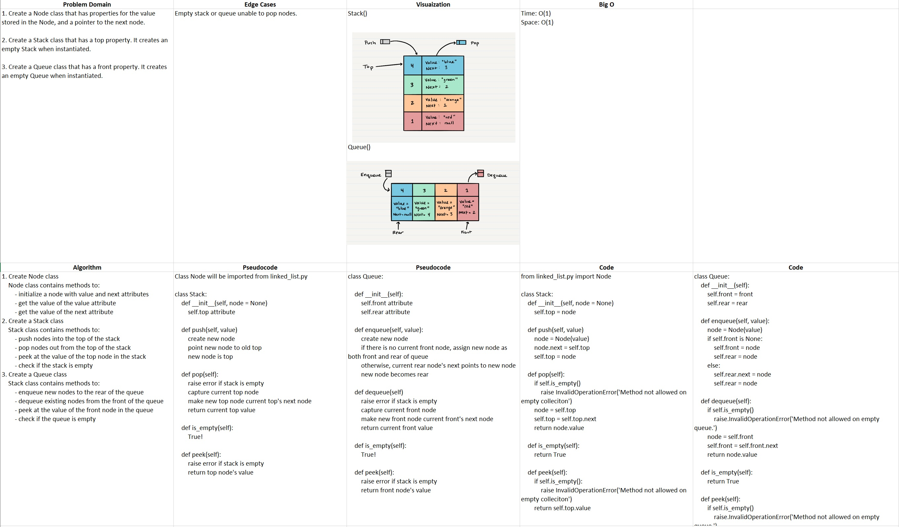

# README

## Stacks and Queues

### Author: Alex Angelico

### Problem Domain

1. Create a Node class that has properties for the value stored in the Node, and a pointer to the next node.

2. Create a Stack class that has a top property. It creates an empty Stack when instantiated.

3. Create a Queue class that has a front property. It creates an empty Queue when instantiated.

### Inputs and Expected Outputs

Input | Expected Output
----- | ---------------
Node(1) | {1}
Stack() [1, 2, 3, 4, 5] | {1 (top)} -> {2} -> {3} -> {4} -> {5}
Queue() [1, 2, 3, 4, 5] | {5 (rear)} -> {4} -> {3} -> {2} -> {1 (front)}

### Big O

Time: O(1)  
Space: O(1)

### Whiteboard

### Change Log

0.1: Started building stack and queue classes - 12 Jan 2021
