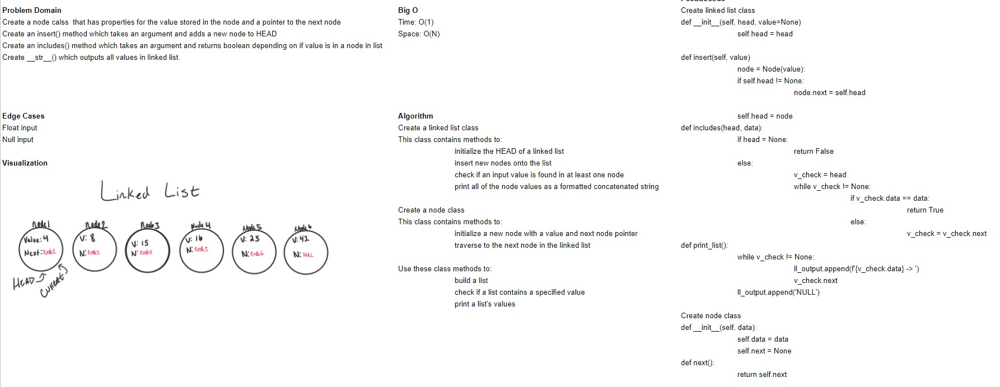

# README

## Linked List Implementation

### Author: Alex Angelico

### Contributors: Anothy Beaver

### Problem Domain

Create a node calss  that has properties for the value stored in the node and a pointer to the next node.

### Inputs and Expected Outputs

Input | Expected Output
----- | ---------------
[3, 6, 10], 3 | '{10} -> {6} -> {3} -> NULL', True
[None, 4], 99 | '{4} -> {None} -> NULL', False

### Big O

Time: O(1)  
Space: O(N)

### Whiteboard

### Change Log

1.0: Completed Functionality - 19 Dec 2020
